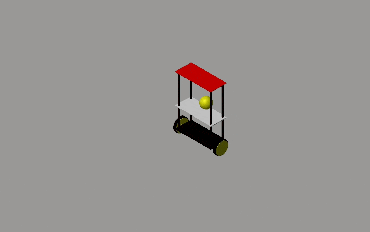
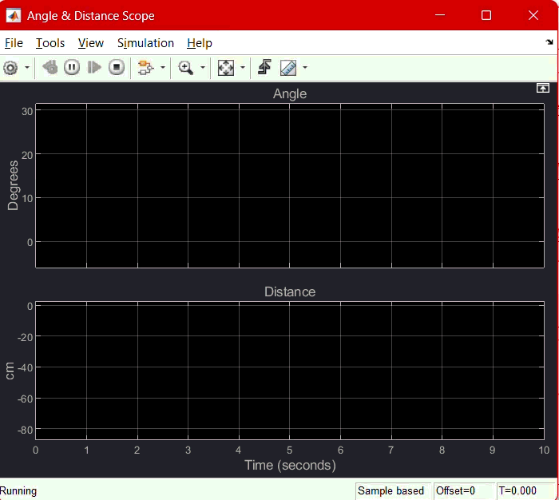
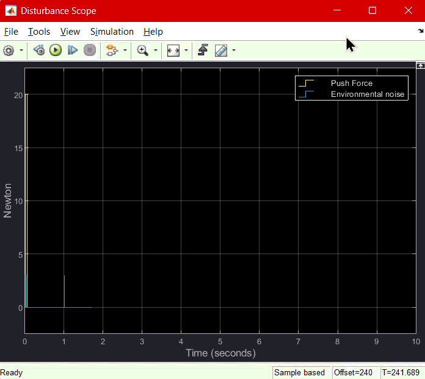
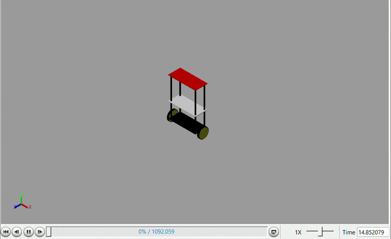

# Self-Balancing Robot Simulation using Simscape (MATLAB)

## 📌 Overview

This project presents a **Self-Balancing Robot simulation using Simscape (MATLAB/Simulink)**.

The system is designed to:
- Maintain robot balance automatically
- Control the robot tilt angle
- Move the robot a specified distance
- Respond to external forces and environmental disturbances

A ball-based mechanism is also integrated to enhance stability and demonstrate advanced dynamic interaction.

---

## ⚙️ Features

### 🎯 Self-Balancing System
The robot stabilizes itself using a closed-loop control system that continuously corrects its orientation.

---

### 🚗 Position / Distance Movement & 📐 Tilt Angle Control
The robot can move a defined distance while maintaining stability.

---

### 🌍 Environment Interaction Signal
A dedicated signal simulates environmental effects acting on the robot.

---

### 💪 External Force Input
Another input is used to apply external forces to test robustness and disturbance rejection.

---

## 🧱 System Architecture

The model is built using **Simscape Multibody + Simulink**, and consists of:

### 🔹 Mechanical System
- Robot rigid body structure
- Joint connections and constraints
- Ball interaction mechanism

### 🔹 Physics Layer (Simscape)
- Spatial Contact Forces
- Gravity and collision modeling
- Multibody dynamics

### 🔹 Sensors
- IMU (orientation measurement)
- Position and velocity sensors
- Angle feedback signals

### 🔹 Control System (Simulink)
- Feedback controller loop
- Error correction logic
- Signal processing blocks

### 🔹 Input Signals
- Environment disturbance signal
- External force signal
- Reference motion commands

---

## 📦 Simscape Setup

This project uses:

- Simscape
- Simscape Multibody
- Simulink
- Control System Toolbox

### ⚠️ Notes:
- Make sure Simscape is properly installed and initialized
- Use appropriate solver settings for stable simulation
- Ensure multibody configuration is correctly set up

---

## 🧠 Concept

The system is a **closed-loop control system**:

Input Signals → Physical System → Sensors → Controller → Correction → System Stability

This makes it similar to real-world:
- Inverted pendulum systems
- Self-balancing robots
- Autonomous mobile platforms

---

## 🚀 Future Improvements

- PID tuning optimization
- LQR control implementation
- Real hardware implementation (Arduino / STM32)
- Adaptive / AI-based control
- Path planning & navigation layer

---

## 🏁 Result

The simulation demonstrates:
- Stable self-balancing behavior
- Controlled motion and positioning
- Disturbance rejection capability
- Realistic physical interaction using Simscape

---

## 📎 Notes

- All GIFs illustrate real simulation behavior
- Fully built in MATLAB/Simulink environment
- No physical hardware required (simulation only project)
  
---

## ✍️ Author

Abdelrahman Shaheen
